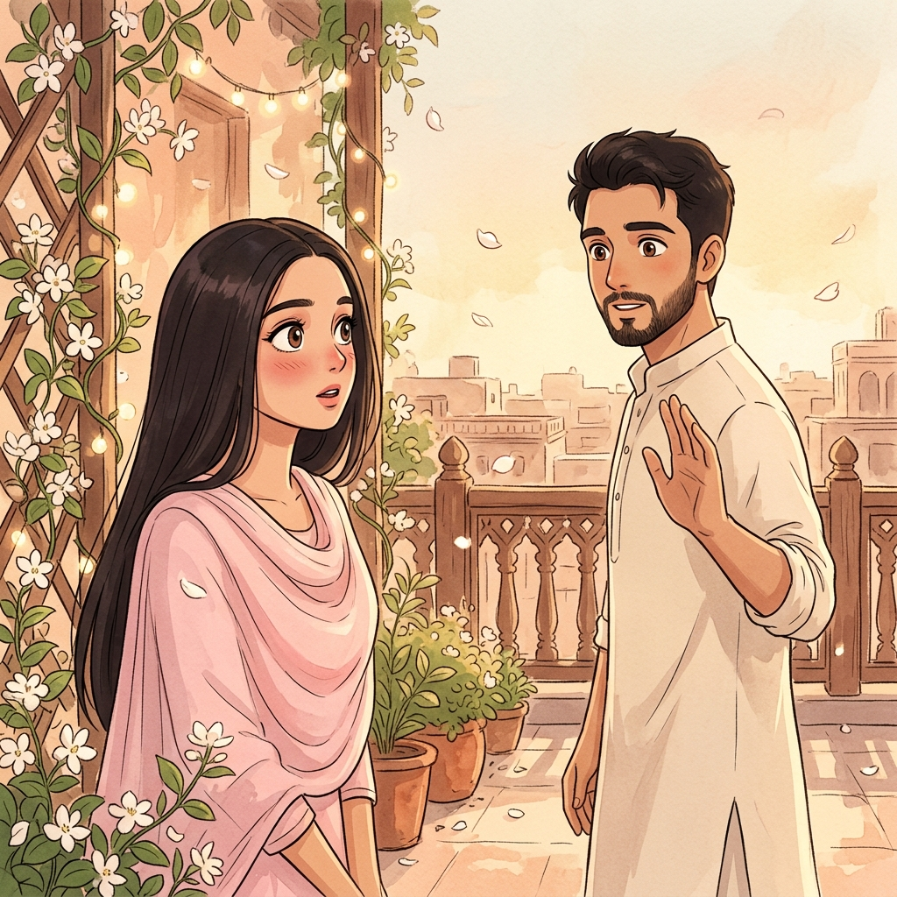

# Nano Banana (Google AI) Prompts
## For Shahzaib & Momna — Studio Ghibli Styled Photos

Use these prompts with **Google AI Studio's Nano Banana (Gemini image generation)** or any Ghibli-style image model. Upload the reference photo of you two, then paste the matching prompt.

---

## 🌿 Global Style Prefix
Paste this at the start of EVERY prompt for consistency:

> **"Studio Ghibli anime style illustration, hand-drawn look, soft warm golden-hour lighting, painterly watercolor backgrounds, soft cel-shading, delicate linework, dreamy atmospheric depth, in the style of Hayao Miyazaki and Makoto Shinkai, preserving the exact facial features and likeness of the people in the reference photograph, South Asian couple, she in soft traditional attire, he in formal wear, tender affectionate mood, cinematic composition, highly detailed background, 4K"**

---

## IMG_01 · The First Look  (gallery: square 2×2)
**Scene:** The very first glance, a soft moment of recognition.

> Ghibli-style reimagining of this couple at the moment they first see each other. She's in a soft pastel dupatta, subtly blushing, eyes wide and warm. He stands a few steps away, mid-breath, hand slightly raised as if to wave. Background: a sunlit terrace with drifting jasmine petals, soft bokeh of fairy lights, warm peach-and-cream palette. The expression in their eyes says "oh — it's you."

---

## IMG_02 · The Proposal  (gallery: wide 3×1)
**Scene:** The moment of the question.

> Ghibli-style scene of a tender proposal. He's on one knee, holding a small velvet ring box, looking up at her with trembling hope. She has one hand over her mouth, the other reaching toward him, eyes shining. Setting: a quiet garden at dusk with lanterns, soft pink sky, petals drifting through the air. Painterly watercolor style, warm golden glow, candle-lit foreground, cinematic framing — like a still from a Miyazaki film.

---

## IMG_03 · The Ring  (gallery: tall 1×2)
**Scene:** Close-up of the ring going on her finger.

> Intimate Ghibli-style close-up of a gentle hand sliding a delicate gold ring onto a slender finger. Soft focus on the hands, warm skin tones, the glint of gold catching the evening light. Background softly blurred: silk fabric in blush and cream, a few jasmine flowers, warm lantern-glow bokeh. Delicate linework, painted shadows, tender and reverent mood.

---

## IMG_04 · Just Laughing  (gallery: slim 2×1)
**Scene:** A candid laugh.

> Ghibli-style candid illustration of the couple mid-laugh, heads tilted toward each other, genuine joy on both faces, her eyes scrunched shut, him grinning widely. Setting: a sunlit café or rooftop in soft afternoon light, chai cups on a small wooden table, wind gently tossing her dupatta. Warm palette of honey, cream, and rose. Expressions full of life and familiarity — like they've shared this laugh a hundred times.

---

## IMG_05 · Hands Held  (gallery: slim 2×1)
**Scene:** Hands intertwined.

> Ghibli-style close-up illustration of two hands intertwined, fingers laced — her henna-patterned hand and his. Setting: soft sunlight filtering through a window, white curtains billowing gently, dust motes catching the light. Delicate watercolor textures, warm golden tones, focus entirely on the hands — a quiet, eternal promise captured in a single frame.

---

## IMG_06 · Golden Hour  (gallery: wide 3×1)
**Scene:** The two of them walking together at sunset.

> Ghibli-style wide cinematic shot of the couple walking side-by-side during golden hour, silhouetted gently against a glowing orange-pink sky. She's leaning slightly into him, his arm around her shoulder. Setting: an open meadow or quiet seaside road, tall grass swaying, a few birds in the distance. Painterly clouds with warm coral and lavender hues, sun flares, dreamy atmospheric haze. The composition feels like a still from "The Wind Rises" — peaceful, infinite, forever.

---

## IMG_07 · Us, Today  (gallery: square 2×2)
**Scene:** A portrait of them now, three years on.

> Ghibli-style portrait of the couple today, side by side, looking softly at the viewer. She's in elegant engagement attire (pastel pink or ivory), he in a crisp sherwani. Subtle traditional motifs in background — arabesque patterns, soft hanging lights. Warm cream-and-gold palette, delicate cel-shading, painted textures on fabric, gentle smiles full of three years of love. The kind of portrait that lives on a mantle forever.

---

## 💡 Tips for Best Results
1. **Always upload a reference photo** of you two alongside the prompt — Nano Banana / Gemini preserves likeness much better with a visual anchor.
2. **Run each prompt 3–4 times** and pick the best output.
3. **If faces drift**, add: *"Keep the exact face proportions, hairstyle, and skin tone from the reference photograph."*
4. **For even softer Ghibli feel**, add: *"flat color palette, minimal shading, storybook illustration."*
5. **For more romance**, add: *"petals drifting in the air, soft bokeh, shallow depth of field."*

---

## 📐 Placing Images in the Site

Each gallery item in the code has a `tag` like `IMG_01 · the_first_look.png`.

To add real images, open `components.jsx`, find the `items` array inside `Gallery()`, and replace the placeholder `<div className="ph">` with:

```jsx

```

Create an `images/` folder in the project and save your generated files using the exact filenames in each tag:
- `images/the_first_look.png`
- `images/proposal_day.png`
- `images/ring_moment.png`
- `images/laughing.png`
- `images/hands_held.png`
- `images/golden_hour.png`
- `images/us_today.png`

---

Made with love for Momna. 🤍
